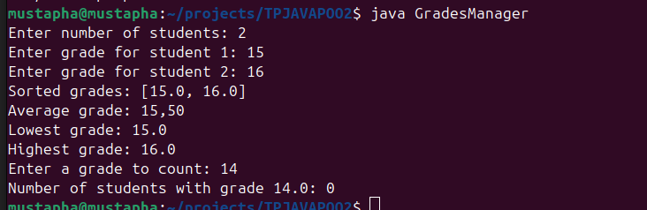
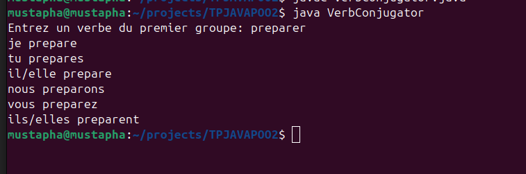
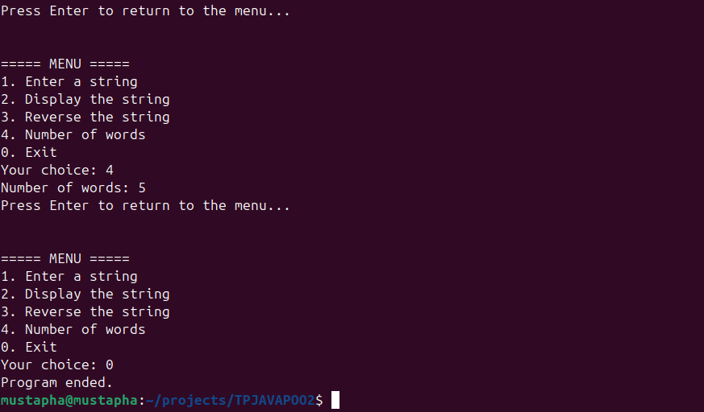
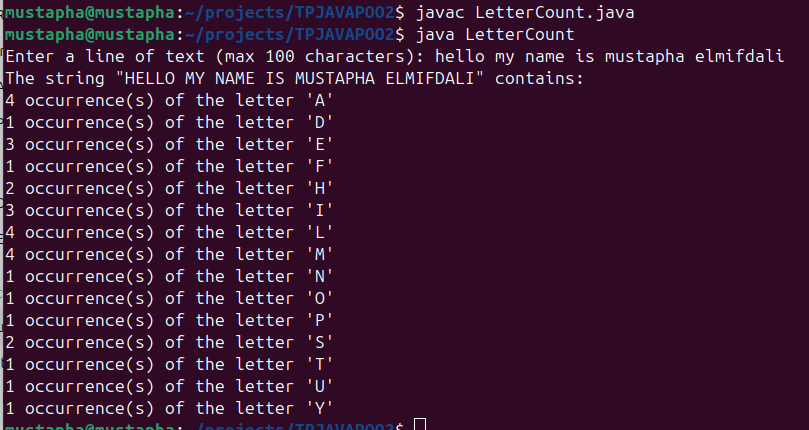

# Devoir : Strings, Arrays et OOP en Java

**Auteur : Mustapha Elmifdali (SDIA-M1)**

## Exercice 1 : Gestion des notes des étudiants
**Problème :**  
Stocker les notes des étudiants dans un tableau, puis effectuer plusieurs opérations :  
- Trier les notes  
- Calculer la moyenne  
- Trouver la note la plus haute et la plus basse  
- Compter le nombre d’étudiants ayant une note spécifique  

**Solution :**  
- Utilisation d’un tableau `int[] grades`  
- Méthode `Arrays.sort()` pour le tri  
- Boucles pour la moyenne, le min/max et le comptage  

**Exécution :**  

---

## Exercice 2 : Conjugaison d’un verbe du premier groupe
**Problème :**  
Lire un verbe régulier en `-er` et afficher sa conjugaison au présent.  

**Solution :**  
- Vérifier que le verbe se termine par `-er`  
- Extraire le radical et ajouter les terminaisons correspondantes  

**Exécution :**  

---

## Exercice 3 : Opérations sur une chaîne de caractères
**Problème :**  
Créer un menu permettant de :  
- Entrer une chaîne  
- Afficher la chaîne  
- Inverser la chaîne  
- Compter le nombre de mots  

**Solution :**  
- Utilisation de `Scanner` pour la saisie  
- `StringBuilder` pour inverser  
- `split("\\s+")` pour compter les mots  

**Exécution :**  

---

## Exercice 4 : Comptage des lettres
**Problème :**  
Compter le nombre d’occurrences de chaque lettre (insensible à la casse) dans une chaîne.  

**Solution :**  
- Tableau `int[26]` pour chaque lettre  
- Conversion de la chaîne en majuscules  
- Boucle pour compter les lettres  

**Exécution :**  

